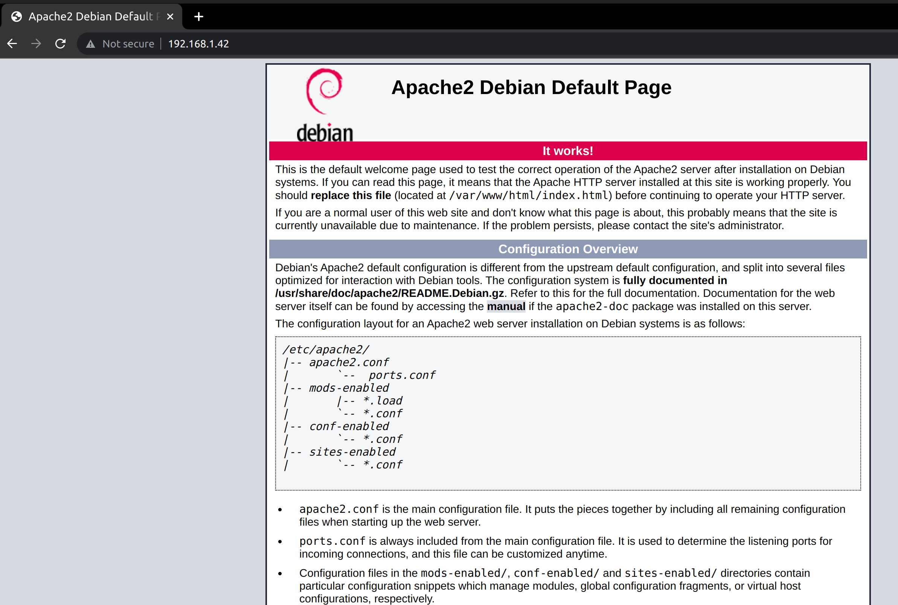
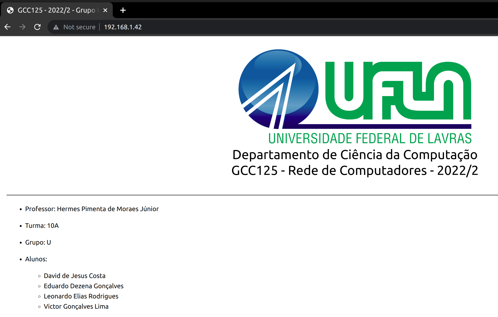
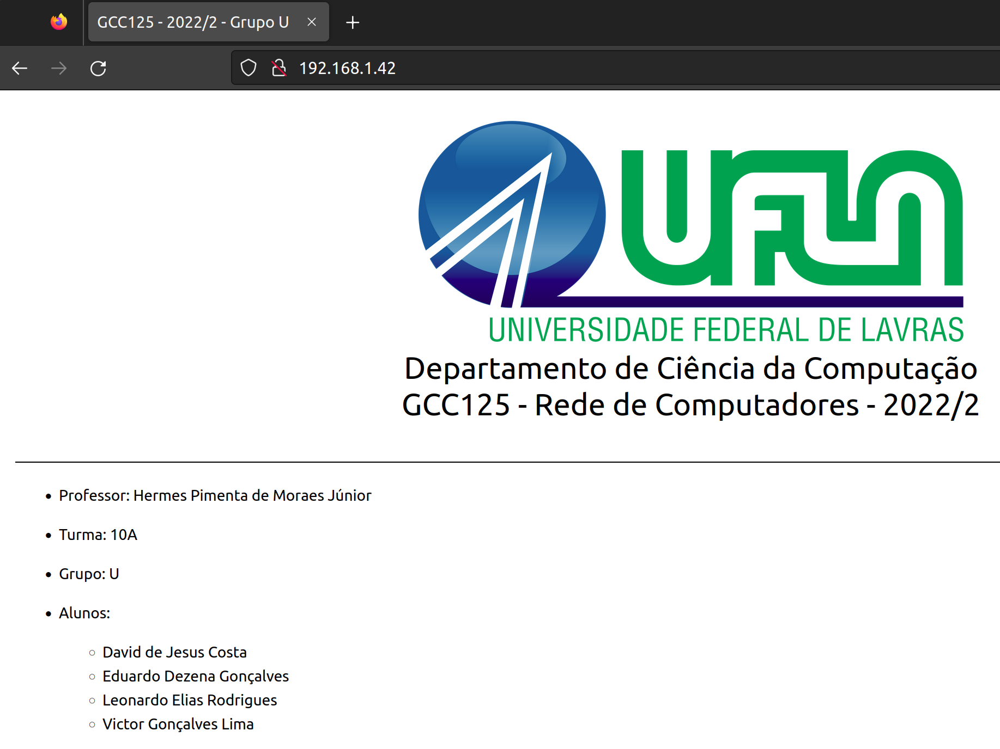

# 
  Departamento de Ciência da Computação   GCC125 - Rede de Computadores - 2022/2 

# Trabalho de Instalação - Etapa 1

- Professor: Hermes Pimenta de Moraes Júnior

- Turma: 10A

- Grupo: U

- Alunos:
    - David de Jesus Costa
    - Eduardo Dezena Gonçalves
    - Leonardo Elias Rodrigues
    - Victor Gonçalves Lima

# 1. Acesso às Máquinas Virtuais (VM's)

## 1.1. Acesso por meio de VPN para sistemas Debian e Ubuntu

Primeiro, é necessário garantir a instalação do pacote ``network-manager-openvpn-gnome``.

    sudo apt install network-manager-openvpn-gnome

Acrecentamos uma nova VPN, importando o arquivo ``laboratorio.ovpn`` e logando com usuário e senha da UFLA.

Após conectado, utilizamos o comando ``ssh`` em terminal local para acessar as VM's (**192.168.1.41** e **192.168.1.42**).

    ssh aluno@192.168.1.41
    ssh aluno@192.168.1.42

## 1.2. Alteração da senha padrão

A senha do usuário **aluno** foi alterado em ambas as VM's (**192.168.1.41** e **192.168.1.42**) através do comando ``passwd``. A nova senha é **gpu2022/2**.

    sudo passwd

# 2. Serviço de sincronização de hora

## 2.1. Sincronizando a hora da primeira VM com um servidor do <a href="https://ntp.br/">NTP.br</a>

Uma vez logado na VM **192.168.1.41** que se conectará em um servidor do <a href="https://ntp.br/">NTP.br</a> e que será a máquina hospedeira do tempo para a VM **192.168.1.42**, utilizamos o seguinte comando para vizualizar a data e hora atual.

    date

Instalamos o *chrony* utilizando o comando

    sudo apt install chrony

Interronpemos o serviço do *chrony* para modificar o arquivo de configuração dele.

    sudo service stop chrony

Mudamos então o valor da hora para um valor errado (00:00:00) para teste com o comando ``timedatectl set-time`` e verificamos com o comando ``date``.

    sudo timedatectl set-time 00:00:00
    date

Abrimos o seguinte arquivo de configuração do *chrony* na máquina ``/etc/chrony/chrony.conf`` para editar com o comando ``nano``.

    sudo nano /etc/chrony/chrony.conf

E configuramos para o seguinte estado, corforme o tutorial do <a href="https://ntp.br/guia/linux/">NTP.br</a>.

    # servidores publicos do NTP.br com NTS disponível
    server a.st1.ntp.br iburst
    server b.st1.ntp.br iburst
    server c.st1.ntp.br iburst
    server d.st1.ntp.br iburst
    server gps.ntp.br iburst

    # caso deseje pode configurar servidores adicionais com NTS, como os da cloudflare e netnod
    # nesse caso basta descomentar as linhas a seguir
    # server time.cloudflare.com iburst nts
    # server nts.netnod.se iburst nts

    # arquivo usado para manter a informação do atraso do seu relógio local
    driftfile /var/lib/chrony/chrony.drift

    # local para as chaves e cookies NTS
    ntsdumpdir /var/lib/chrony

    # se quiser um log detalhado descomente as linhas a seguir
    #log tracking measurements statistics
    #logdir /var/log/chrony

    # erro máximo tolerado em ppm em relação aos servidores
    maxupdateskew 100.0

    # habilita a sincronização via kernel do real-time clock a cada 11 minutos
    rtcsync

    # ajusta a hora do sistema com um "salto", de uma só vez, ao invés de
    # ajustá-la aos poucos corrigindo a frequência, mas isso apenas se o erro
    # for maior do que 1 segundo e somente para os 3 primeiros ajustes
    makestep 1 3

    # diretiva que indica que o offset UTC e leapseconds devem ser lidos
    # da base tz (de time zone) do sistema
    leapsectz right/UTC

Após salvar o arquivo, iniciamos o serviço do *chrony*.

    sudo systemctl start chrony

Com o seguinte comando, podemos verificar os servidores do <a href="https://ntp.br">NTP.br</a> adicionados como fontes.

    chronyc sources

E utilizando o seguinte comando, podemos verificar o status da sincronização do relógio da máquina, que mostrará a mesma sincronizada de acordo com o servidor ``gps.jd.ntp.br`` (prioridade).

    chronyc tracking

Utilizando novamente o comando ``date`` para verificar a data da máquina, percebemos que ela foi sincronizada, e se tentarmos alterá-la novamente com ``sudo timedatectl set-time 00:00:00``, receberemos a seguinte mensagem de erro:

    Failed to set time: Automatic time synchronization is enabled

## 2.2. Sincronizando a hora da segunda VM com a primeira

Abrimos novamente o arquivo de configuração na primeira VM (192.168.1.41) com o comando ``sudo nano /etc/chrony/chrony.conf`` e adicionamos o seguinte trecho, permitindo que a segunda VM (192.168.1.42) consiga acessar a primeira como cliente NTP.

    [...]

    # permitime acesso aos seguintes clientes NTP
    allow 192.168.1.42

Executamos os mesmos passos anteriores para instalação do *chrony* na segunda VM (192.168.1.42).

    sudo apt install chrony
    sudo systemctl stop chrony

Novamente colocamos a data em um estado incorreto para teste e verificamos.

    sudo timedatectl set-time 00:00:00
    date

Abrimos e modificamos o seguinte arquivo de configuração do *chrony* na máquina com o comando ``sudo nano /etc/chrony/chrony.conf`` e adicionamos a primeira máquina virtual como servidor a ser buscado.

    # servidores publicos do NTP.br com NTS disponível
    server 192.168.1.41 iburst

    [...]

Ativamos o serviço do *chrony* e verificamos com os seguintes comandos que o tempo da máquina está sincronizada com a máquina **192.168.1.41**.

    chronyc sources
    chronyc tracking
    date

# 3. Servidor WEB

Os passos abaixo foram usados para configurar o servidor WEB na VM **192.168.1.42**.

## 3.1. Instalação do servidor Apache 2

A instalação do apache 2 foi feita com os seguintes comandos:

    sudo apt update
    sudo apt install apache2

## 3.2. Testando a instalação do servidor WEB

Em um browser de uma máquina conectada às VM's por meio de VPN, é digitado o endereço IP da VM do servidor WEB: **http://192.168.1.42**.

A seguinte página do servidor web do Apache é exibida, mostrando o funcionamento.

## 3.3. Inserindo páginas html no servidor web

Com o seguinte comando, vamos ao diretório do servidor apache onde os arquivos html serão dispostos:

    cd /var/www/html/

Com o seguinte comando, removemos todos os arquivos da pasta a fim de preparar o ambiente para nossos arquivos.

    sudo rm *

Nossos arquivos são baixados do repositório <a href="https://github.com/Victorgonl/GCC125-20222-GrupoU">https://github.com/Victorgonl/GCC125-20222-GrupoU</a> através do comando ``wget`` dentro da pasta ``/var/www/html/``.

    sudo wget https://raw.githubusercontent.com/Victorgonl/GCC125-20222-GrupoU/master/index.html
    sudo wget https://raw.githubusercontent.com/Victorgonl/GCC125-20222-GrupoU/master/ufla.png
    sudo wget https://raw.githubusercontent.com/Victorgonl/GCC125-20222-GrupoU/master/TI-Relatorio-Etapa1.html
    sudo wget https://raw.githubusercontent.com/Victorgonl/GCC125-20222-GrupoU/master/TI-R1-1.1.png
    sudo wget https://raw.githubusercontent.com/Victorgonl/GCC125-20222-GrupoU/master/TI-R1-3.2-1.png
    sudo wget https://raw.githubusercontent.com/Victorgonl/GCC125-20222-GrupoU/master/TI-R1-3.2-2.png
    sudo wget https://raw.githubusercontent.com/Victorgonl/GCC125-20222-GrupoU/master/TI-R1-3.3.png
    sudo wget https://raw.githubusercontent.com/Victorgonl/GCC125-20222-GrupoU/master/TI-R1-3.4-1.png
    sudo wget https://raw.githubusercontent.com/Victorgonl/GCC125-20222-GrupoU/master/TI-R1-3.4-2.png
    sudo wget https://raw.githubusercontent.com/Victorgonl/GCC125-20222-GrupoU/master/TI-R1-3.4-3.png
    sudo wget https://raw.githubusercontent.com/Victorgonl/GCC125-20222-GrupoU/master/TI-R1-3.4-4.png
    sudo wget https://raw.githubusercontent.com/Victorgonl/GCC125-20222-GrupoU/master/TI-R1-3.4-5.png
    sudo wget https://raw.githubusercontent.com/Victorgonl/GCC125-20222-GrupoU/master/PT-1.pkt

Ao acessarmos novamente por um browser de uma máquina conectada às VM's por meio de VPN o endereço http://192.168.1.42, encontramos nossa página inicial.

## 3.4. Habilitando acesso com criptografia (https) no servidor web

Primeiro, verificamos que o pacote ``openssl``está instalado em nossa máquina de servidor web, a VM de endereço **192.168.1.42**.

    sudo apt install openssl

Em seguida, habilitamos os módulos ``ssl`` e ``rewrite`` do Apache.

    sudo a2enmod ssl
    sudo a2enmod rewrite

Editamos o seguinte arquivo de configuração do Apache com ``nano``.

    sudo nano /etc/apache2/apache2.conf

E adicionamos as seguintes linhas:

    [...]

    <Directory /var/www/html>
        AllowOverride All
    </Directory>

Criamos uma pasta para guardar o certificado ssl que será criado e abrimos a mesma.

    sudo mkdir /etc/apache2/certificate
    cd /etc/apache2/certificate

Dentro da pasta, criamos uma chave privada e o certificado ssl.

    sudo openssl req -new -newkey rsa:4096 -x509 -sha256 -days 365 -nodes -out apache-certificate.crt -keyout apache.key

Neste ponto, entramos com as seguintes informações requisitadas:

    Country Name (2 letter code) [AU]:BR
    State or Province Name (full name) [Some-State]:Minas Gerais
    Locality Name (eg, city) []:Lavras
    Organization Name (eg, company) [Internet Widgits Pty Ltd]:Universidade Federal de Lavras
    Organizational Unit Name (eg, section) []:Departamento de Ciência da Computação
    Common Name (e.g. server FQDN or YOUR name) []:192.168.1.42
    Email Address []:.

Em seguida, editamos o seguinte arquivo com o comando ``nano``:

    sudo nano /etc/apache2/sites-enabled/000-default.conf

O arquivo apresenta inicialmente as configurações:

    <VirtualHost *:80>

            [...]

    </VirtualHost>

Modificamos o mesmo para as seguintes configurações:

    <VirtualHost *:443>

    [...]

            SSLEngine on
            SSLCertificateFile /etc/apache2/certificate/apache-certificate.crt
            SSLCertificateKeyFile /etc/apache2/certificate/apache.key

    </VirtualHost>

Por fim reiniciamos o serviço do Apache.

    sudo systemctl restart apache2

Primeiro, acessamos a página inicial utilizando ``http``.

A página é carregada com sucesso.

Agora tentaremos acessar a página utilizando ``https``.

Inicialmente é gerado uma aviso de segurança no browser: ``The certificate is not trusted because it is self-signed``, isto porque o certificado ssl foi criado pelo próprio servidor, o que não garante segurança real aos usuários.

Ignorando o aviso, a página html criptografada é carregada com sucesso.

# 4. Acessando os relatórios e trabalhos entregues do grupo por meio do servidor WEB

## 4.1. Relatórios dos trabalhos de instalação

Este relatório pode ser acessado por meio do link disponibilizado na página inicial do servidor web.

## 4.2.  Trabalhos em Packet Tracer

Os arquivos ``.pkt`` estão disponíveis para download na página inicial do servidor web.

# 5. Referências

- KUROSE, Jim; ROSS, Keith W. Redes de computadores e a internet: uma abordagem
top-down. 7ed. São Paulo: Pearson, 2013.

- MORAES JÚNIOR, H. P.. Materiais da Disciplina GCC125 - Redes de Computadores. Universidade Federal de Lavras. Acesso em: 10 de jan. de 2023.

- Sincronize seus dispositivos Linux ou BSD. Disponível em: <a href="https://ntp.br/guia/linux/">https://ntp.br/guia/linux/</a>. Acesso em: 10 de jan. de 2023.

- chronyc - command-line interface for chrony daemon. Disponível em: <a href="https://manpages.ubuntu.com/manpages/jammy/man1/chronyc.1.html">https://manpages.ubuntu.com/manpages/jammy/man1/chronyc.1.html</a>. Acesso em: 10 de jan. de 2023.

- Enable HTTPS on Apache. Disponível em: <a href="https://techexpert.tips/apache/enable-https-apache/">https://techexpert.tips/apache/enable-https-apache/</a>. Acesso em: 10 de jan. de 2023.
