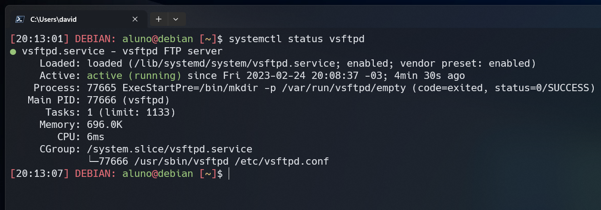
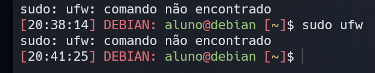
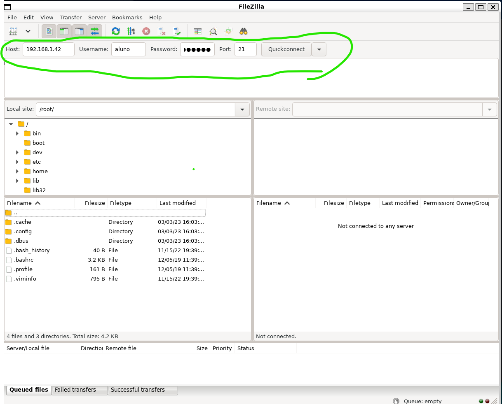
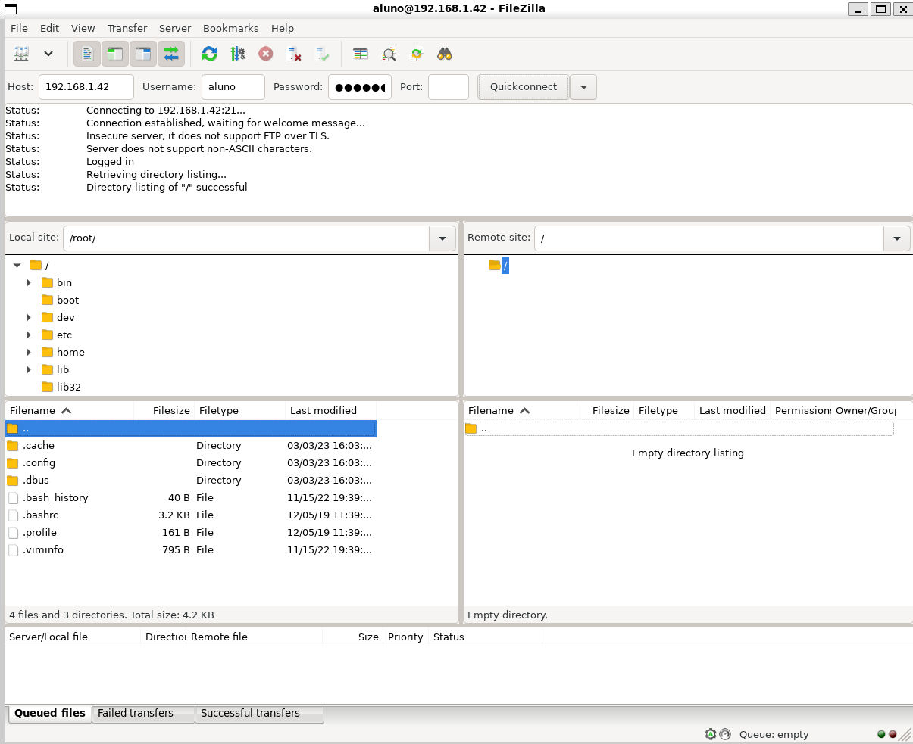
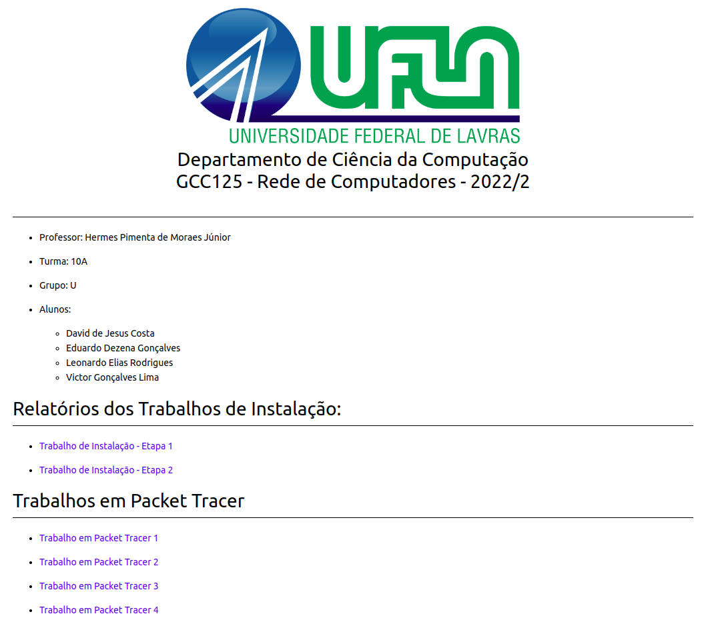

# 
  Departamento de Ciência da Computação   GCC125 - Rede de Computadores - 2022/2 

# Trabalho de Instalação - Etapa 2

- Professor: Hermes Pimenta de Moraes Júnior

- Turma: 10A

- Grupo: U

- Alunos:
    - David de Jesus Costa
    - Eduardo Dezena Gonçalves
    - Leonardo Elias Rodrigues
    - Victor Gonçalves Lima

# 1. Servidor FTP

## 1.1. Criação FTP

    sudo apt-get update && sudo apt-get upgrade
    // Atualiza Pacotes

    sudo apt install vsftpd
    //Comando para instalar o serviço ftp, o serviço vai ser iniciado após a instalação

    systemctl status vsftpd
    // Comando para verificar o status do serviço

    // Se não estivesse ativo iríamos usar o comando abaixo para iniciar:

    sudo systemctl enable --now vsftpd

# 1.2. Habilitar as portas do VSFTPD:

O servidor não possui o serviço de firewall(ufw) instalado, a imagem abaixo mostra quando consultamos se ele existe:

Caso possuíssemos, iríamos rodar os seguintes comandos:

    sudo ufw allow 20/tcp
    sudo ufw allow 21/tcp
    sudo ufw allow 990/tcp
    sudo ufw allow 5000:10000/tcp

    //FTP usa a porta 20 para o modo ativo, porta 21 para comandos e as outras para modo passivo.

# 1.3. Atribuindo permissões ao usuário

Vamos utilizar o mesmo usuário do a acesso ao servidor que no caso é aluno para este trabalho.

    sudo mkdir /ftp
    // Criando a pasta para o ftp

    sudo chown aluno /ftp
    // altera o proprietário do diretório /ftp para o usuário aluno

# 1.4. Configurando o ftp

    sudo vim /etc/vsftpd.conf
    //Abrindo o arquivo de configuração do serviço vsftpd

    //Vamos retirar os comentários das seguintes linhas do arquivo de configuração:

    ...
    anonymous_enable=NO
    local_enable=YES
    write_enable=YES
    ...

    //Pode ser que algumas configurações já estejam sem comentário entretanto são esse que precisamos tirar os comentários

    //Depois adicionamos a seguinte linha no final do arquivo de configuração:

    local_root=/ftp

    // Isto especifica o diretório raiz para o qual os usuários do FTP serão conectados após fazerem login

    //Para salvar o arquivo e fecha-lo no vim clicamos na teclas ESC depois digitamos :wq em as flags w=write e q=quit

# 1.5. Bloqueando acesso do usuário

Por questões de segurança, vamos bloquear o usuário do ftp a ter acesso
somente ao diretório padrão e seus sub diretórios, pois por padrão o ftp
permite ao usuário acessar todos os arquivos do servidor.

    // Temos que retirar os comentários das seguintes linhas do arquivo de configuração citado anteriormente:

    ...
    chroot_local_user=YES
    chroot_list_enable=YES
    chroot_list_file=/etc/vsftpd.chroot_list
    ...

    // Vamos adicionar a seguinte linha

    allow_writeable_chroot=YES

    // Esse comando permite que os usuários com chroot habilitado possam gravar em seus diretórios raiz

    // vamos definir a permissão padrão para arquivos criados retirando o comentário da linha:

    local_umask=0002

    // clicamos em Esc e depois digitamos :wq para salvar e sair do arquivo

# 1.8. Testar FTP

    // Para testar o funcionamento do ftp utilizamos o filezilla, primeiro instalamos ele em nossas máquinas pessoal e rodamos ele com os respectivos comandos:

    sudo apt install filezilla
    sudo filezilla

Uma interface gráfica foi aberta e nela colocamos as informações necessárias para verificarmos o funcionamento do ftp.

Obtivemos sucesso:

# 1.6. Criação do arquivo chroot_list

    // Vamos criar o arquivo chroot_list para especificar quais usuários devem ser restritos a seus próprios diretórios de trabalho (chrooted) quando se conectam ao servidor FTP

    sudo touch /etc/vsftpd.chroot_list

    // Para verificar se o arquivo foi criado digitamos:
    sudo vim /etc/vsftpd.chroot_list

# 1.7. Aplicando Alterações

    // Para aplicarmos as alterações vamos reiniciar o serviço vsftpd com seguinte comando:

    sudo systemctl restart --now vsftpd

    // Agora para verificarmos se o serviço está rodando digitamos:

    sudo systemctl status vsftpd

    // O resultado será o abaixo:

# 2. Servidor DNS

## 2.1. Instalação e confiuguração do servidor DNS na VM `192.168.1.41`

Inicialmente, instalamos os pacotes na VM que será o servidor DNS (`192.168.1.41`)

    sudo apt install bind9
    sudo apt install dnsutils

Verificamos o seguinte arquivo de configuração de servidores DNS.

    sudo nano /etc/bind/named.conf.options

Ficando disposto assim:

    forwarders {
        1.1.1.1; // Cloudflare DNS
        8.8.4.4; // Google DNS
        8.8.8.8; // Google DNS
    };

Abrimos o arquivo:

    sudo nano /etc/bind/named.conf.local

E adicionamos as seguintes configurações:

    zone "dns.grupou.gcc125.br" {
        type master;
        file "/etc/bind/db.dns.grupou.gcc125.br";
    };

    zone "www.grupou.gcc125.br" {
        type master;
        file "/etc/bind/db.www.grupou.gcc125.br";
    };

    zone "ftp.grupou.gcc125.br" {
        type master;
        file "/etc/bind/db.ftp.grupou.gcc125.br";
    };

    zone "time.grupou.gcc125.br" {
        type master;
        file "/etc/bind/db.time.grupou.gcc125.br";
    };

Criamos os arquivos `db`dos domínios:

    sudo cp /etc/bind/db.local /etc/bind/db.dns.grupou.gcc125.br
    sudo cp /etc/bind/db.local /etc/bind/db.www.grupou.gcc125.br
    sudo cp /etc/bind/db.local /etc/bind/db.ftp.grupou.gcc125.br
    sudo cp /etc/bind/db.local /etc/bind/db.time.grupou.gcc125.br

Editamos cada arquivo para configurar o endereços IPs dos serviços:

    sudo nano /etc/bind/db.dns.grupou.gcc125.br
    sudo nano /etc/bind/db.www.grupou.gcc125.br
    sudo nano /etc/bind/db.ftp.grupou.gcc125.br
    sudo nano /etc/bind/db.time.grupou.gcc125.br

`/etc/bind/db.dns.grupou.gcc125.br`

    ;
    ; BIND data file for local loopback interface
    ;
    $TTL    604800
    @       IN      SOA     dns.grupou.gcc125.br. root.dns.grupou.gcc125.br. (
                                2         ; Serial
                            604800         ; Refresh
                            86400         ; Retry
                            2419200         ; Expire
                            604800 )       ; Negative Cache TTL
    ;
    @       IN      NS      dns.grupou.gcc125.br.
    @       IN      A       192.168.1.41
    @       IN      AAAA    ::1

`/etc/bind/db.www.grupou.gcc125.br`

    ;
    ; BIND data file for local loopback interface
    ;
    $TTL    604800
    @       IN      SOA     www.grupou.gcc125.br. root.www.grupou.gcc125.br. (
                                2         ; Serial
                            604800         ; Refresh
                            86400         ; Retry
                            2419200         ; Expire
                            604800 )       ; Negative Cache TTL
    ;
    @       IN      NS      www.grupou.gcc125.br.
    @       IN      A       192.168.1.42
    @       IN      AAAA    ::1

`/etc/bind/db.ftp.grupou.gcc125.br`

    ;
    ; BIND data file for local loopback interface
    ;
    $TTL    604800
    @       IN      SOA     ftp.grupou.gcc125.br. root.ftp.grupou.gcc125.br. (
                                2         ; Serial
                            604800         ; Refresh
                            86400         ; Retry
                            2419200         ; Expire
                            604800 )       ; Negative Cache TTL
    ;
    @       IN      NS      ftp.grupou.gcc125.br.
    @       IN      A       192.168.1.42
    @       IN      AAAA    ::1

`/etc/bind/db.time.grupou.gcc125.br`

    ;
    ; BIND data file for local loopback interface
    ;
    $TTL    604800
    @       IN      SOA     time.grupou.gcc125.br. root.time.grupou.gcc125.br. (
                                2         ; Serial
                            604800         ; Refresh
                            86400         ; Retry
                            2419200         ; Expire
                            604800 )       ; Negative Cache TTL
    ;
    @       IN      NS      time.grupou.gcc125.br.
    @       IN      A       192.168.1.41
    @       IN      AAAA    ::1

Reiniciamos o serviço

    sudo systemctl restart bind9.service

Editamos o arquivo para resolver o *Reverse zone*:

    sudo nano /etc/bind/named.conf.local

    zone "1.168.192.in-addr.arpa" {
        type master;
        file "/etc/bind/db.1.168.192";
    };

Criamos o arquivo `/etc/bind/db.1.168.192`

sudo cp /etc/bind/db.127 /etc/bind/db.1.168.192

E o editamos para o seguinte estado com `sudo nano /etc/bind/db.1.168.192`:

    ;
    ; Zone file for 1.168.192.in-addr.arpa
    ;
    $TTL 604800
    @ IN SOA grupou.gcc125.br. root.grupou.gcc125.br. (
                3   ; Serial
        604800   ; Refresh
            86400   ; Retry
        2419200   ; Expire
        604800 ) ; Negative Cache TTL
    ;
    @ IN NS ns.
    41 IN PTR ns.grupou.gcc125.br.

Então reiniciamos o serviço:

    sudo systemctl restart bind9.service

Checamos nosso domínio criado com `nslookup grupou.gcc125.br` e obtemos a seguinte resposta indicando que o serviço está funcionando:

    Server:		192.168.1.41
    Address:	192.168.1.41#53

    ** server can't find grupou.gcc125.br: NXDOMAIN

Checamos também o domínio de nossos serviços:

`nslookup dns.grupou.gcc125.br`

    Server:		192.168.1.41
    Address:	192.168.1.41#53

    Name:	dns.grupou.gcc125.br
    Address: 192.168.1.41
    Name:	dns.grupou.gcc125.br
    Address: ::1

`nslookup dns.grupou.gcc125.br`

    Server:		192.168.1.41
    Address:	192.168.1.41#53

    Name:	www.grupou.gcc125.br
    Address: 192.168.1.42
    Name:	www.grupou.gcc125.br
    Address: ::1

`nslookup dns.grupou.gcc125.br`

    Server:		192.168.1.41
    Address:	192.168.1.41#53

    Name:	ftp.grupou.gcc125.br
    Address: 192.168.1.42
    Name:	ftp.grupou.gcc125.br
    Address: ::1

`nslookup dns.grupou.gcc125.br`

    Server:		192.168.1.41
    Address:	192.168.1.41#53

    Name:	time.grupou.gcc125.br
    Address: 192.168.1.41
    Name:	time.grupou.gcc125.br
    Address: ::1

Ao checarmos outros domínios externos também obtemos sucesso:

`nslookup www.google.com`

    Server:		192.168.1.41
    Address:	192.168.1.41#53

    Non-authoritative answer:
    Name:	www.google.com
    Address: 142.251.132.4
    Name:	www.google.com
    Address: 2800:3f0:4001:833::2004

`nslookup www.oul.com.br`

    Server:		192.168.1.41
    Address:	192.168.1.41#53

    Non-authoritative answer:
    Name:	www.oul.com.br
    Address: 5.161.90.154

## 2.2. Configuração da VM `192.168.1.42` para ser cliente DNS da `192.168.1.41`

Na máquina `192.168.1.42`, testamos o que acontece quando procuramos por um domínio externo:

`nslookup www.oul.com.br`

Server:		1.1.1.1
Address:	1.1.1.1#53

Non-authoritative answer:
Name:	www.oul.com.br
Address: 5.161.90.154

Percebemos que o servidor DNS `1.1.1.1` é o responsável pela resposta. Assim, editamos o seguinte arquivo removendo os servidores DNS pré-estabelecidos como `1.1.1.1`da Cloudflare, `8.8.8.8` da Google, etc. E deixamos apenas nosso servidor DNS:

`sudo nano /etc/resolv.conf`

    domain dns.grupou.gcc125.br
    search dns.grupou.gcc125.br
    nameserver 192.168.1.41

Ao testarmos novamente a procura, obtemos a seguinte resposta utilizando nosso servidor DNS:

`nslookup www.oul.com.br`

    Server:		192.168.1.41
    Address:	192.168.1.41#53

    Non-authoritative answer:
    Name:	www.oul.com.br
    Address: 5.161.90.154

`nslookup www.google.com`

    Server:		192.168.1.41
    Address:	192.168.1.41#53

    Non-authoritative answer:
    Name:	www.google.com
    Address: 142.250.219.164
    Name:	www.google.com
    Address: 2800:3f0:4001:833::2004

O mesmo para nossos serviçõs:

`nslookup dns.grupou.gcc125.br`

    Server:		192.168.1.41
    Address:	192.168.1.41#53

    Name:	dns.grupou.gcc125.br
    Address: 192.168.1.41
    Name:	dns.grupou.gcc125.br
    Address: ::1

`nslookup dns.grupou.gcc125.br`

    Server:		192.168.1.41
    Address:	192.168.1.41#53

    Name:	dns.grupou.gcc125.br
    Address: 192.168.1.41
    Name:	dns.grupou.gcc125.br
    Address: ::1

`nslookup dns.grupou.gcc125.br`

    Server:		192.168.1.41
    Address:	192.168.1.41#53

    Name:	dns.grupou.gcc125.br
    Address: 192.168.1.41
    Name:	dns.grupou.gcc125.br
    Address: ::1

`nslookup dns.grupou.gcc125.br`

    Server:		192.168.1.41
    Address:	192.168.1.41#53

    Name:	dns.grupou.gcc125.br
    Address: 192.168.1.41
    Name:	dns.grupou.gcc125.br
    Address: ::1

# 3. Atualização do servidor WEB

No servidor WEB (`192.168.1.42`), foi adicionado o restante dos trabalhos em Packet Tracer, assim como esta documentação. Com o seguinte comando, vamos ao diretório do servidor apache onde os arquivos html serão dispostos:

    cd /var/www/html/

Com o seguinte comando, removemos todos os arquivos da pasta a fim de preparar o ambiente para nossos arquivos.

    sudo rm *

Nossos arquivos são baixados do repositório <a href="https://github.com/Victorgonl/GCC125-20222-GrupoU">https://github.com/Victorgonl/GCC125-20222-GrupoU</a> através do comando ``wget`` dentro da pasta ``/var/www/html/``.

    sudo wget https://raw.githubusercontent.com/Victorgonl/GCC125-20222-GrupoU/master/index.html
    sudo wget https://raw.githubusercontent.com/Victorgonl/GCC125-20222-GrupoU/master/ufla.png
    sudo wget https://raw.githubusercontent.com/Victorgonl/GCC125-20222-GrupoU/master/TI-Relatorio-Etapa1.html
    sudo wget https://raw.githubusercontent.com/Victorgonl/GCC125-20222-GrupoU/master/TI-Relatorio-Etapa2.html
    sudo wget https://raw.githubusercontent.com/Victorgonl/GCC125-20222-GrupoU/master/TI-Relatorio-Etapa1.pdf
    sudo wget https://raw.githubusercontent.com/Victorgonl/GCC125-20222-GrupoU/master/TI-Relatorio-Etapa2.pdf
    sudo wget https://raw.githubusercontent.com/Victorgonl/GCC125-20222-GrupoU/master/TI-R1-1.1.png
    sudo wget https://raw.githubusercontent.com/Victorgonl/GCC125-20222-GrupoU/master/TI-R1-3.2-1.png
    sudo wget https://raw.githubusercontent.com/Victorgonl/GCC125-20222-GrupoU/master/TI-R1-3.2-2.png
    sudo wget https://raw.githubusercontent.com/Victorgonl/GCC125-20222-GrupoU/master/TI-R1-3.3.png
    sudo wget https://raw.githubusercontent.com/Victorgonl/GCC125-20222-GrupoU/master/TI-R1-3.4-1.png
    sudo wget https://raw.githubusercontent.com/Victorgonl/GCC125-20222-GrupoU/master/TI-R1-3.4-2.png
    sudo wget https://raw.githubusercontent.com/Victorgonl/GCC125-20222-GrupoU/master/TI-R1-3.4-3.png
    sudo wget https://raw.githubusercontent.com/Victorgonl/GCC125-20222-GrupoU/master/TI-R1-3.4-4.png
    sudo wget https://raw.githubusercontent.com/Victorgonl/GCC125-20222-GrupoU/master/TI-R1-3.4-5.png
    sudo wget https://raw.githubusercontent.com/Victorgonl/GCC125-20222-GrupoU/master/TI-R2-1.1.png
    sudo wget https://raw.githubusercontent.com/Victorgonl/GCC125-20222-GrupoU/master/TI-R2-1.2.png
    sudo wget https://raw.githubusercontent.com/Victorgonl/GCC125-20222-GrupoU/master/TI-R2-1.7.png
    sudo wget https://raw.githubusercontent.com/Victorgonl/GCC125-20222-GrupoU/master/TI-R2-1.8-1.png
    sudo wget https://raw.githubusercontent.com/Victorgonl/GCC125-20222-GrupoU/master/TI-R2-1.8-2.png
    sudo wget https://raw.githubusercontent.com/Victorgonl/GCC125-20222-GrupoU/master/TI-R2-3.png
    sudo wget https://raw.githubusercontent.com/Victorgonl/GCC125-20222-GrupoU/master/PT-1.pkt
    sudo wget https://raw.githubusercontent.com/Victorgonl/GCC125-20222-GrupoU/master/PT-2.pkt
    sudo wget https://raw.githubusercontent.com/Victorgonl/GCC125-20222-GrupoU/master/PT-3.pkt
    sudo wget https://raw.githubusercontent.com/Victorgonl/GCC125-20222-GrupoU/master/PT-4.pkt

A página WEB atualizada:

# 4. Referências

- KUROSE, Jim; ROSS, Keith W. Redes de computadores e a internet: uma abordagem
top-down. 7ed. São Paulo: Pearson, 2013.

- MORAES JÚNIOR, H. P.. Materiais da Disciplina GCC125 - Redes de Computadores. Universidade Federal de Lavras. Acesso em: 10 de jan. de 2023.

- Domain Name Service (DNS). Disponível em: https://ubuntu.com/server/docs/service-domain-name-service-dns. Acesso em: 05 de mar. de 2023.

- How To Change DNS On Linux. Disponível em: https://www.linuxfordevices.com/tutorials/linux/change-dns-on-linux. Acesso em: 05 de mar. de 2023.
